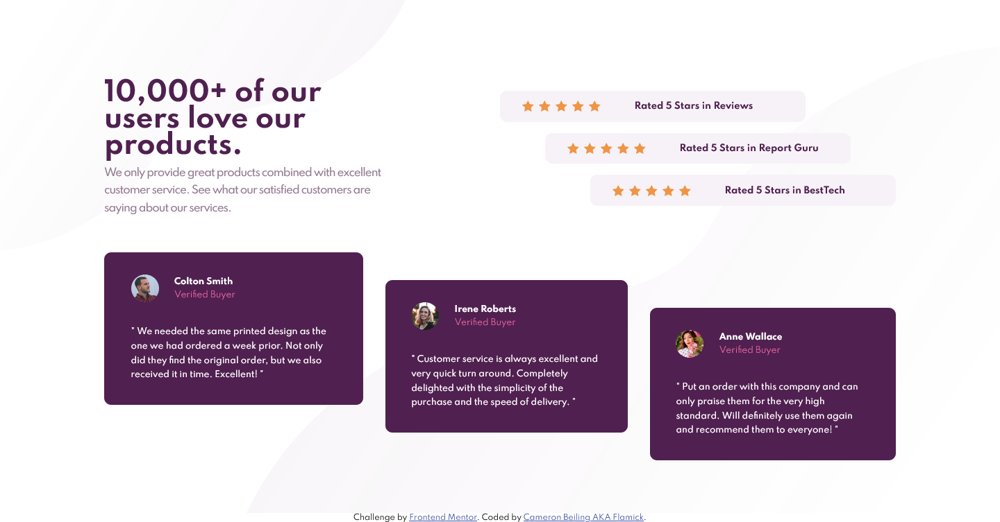
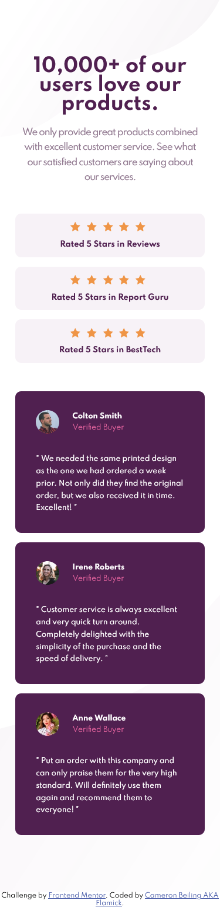

This is my solution to the [Social proof section challenge on Frontend Mentor](https://www.frontendmentor.io/challenges/social-proof-section-6e0qTv_bA). Frontend Mentor challenges help you improve your coding skills by building realistic projects. 

In this challenge I got to use a lot of grid and flexbox for positioning and honestly I learned quite a bit about grid. It's something I haven't really used much up to this point and it was interesting to make a layout using it. 

- Solution URL: [Frontend Mentor Solution](https://www.frontendmentor.io/challenges/3column-preview-card-component-pH92eAR2-/hub/html5-and-css-with-sass-to-compile-the-css-lJ7nOJgex)
- Live Site URL: [Live Website](https://sleepy-curie-1ee2d4.netlify.app/)

-  Mentor - [@Flamick](https://www.frontendmentor.io/profile/flamick)